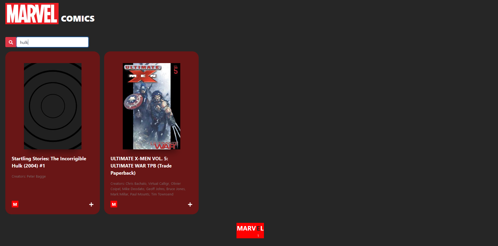

# Comics
Use Marvel's API to list their comics. Each comic includes a link to see more details about it.
It includes also a link to the comic on Marvel's website, as directed by their API.

IT is possible to search comics by character name, and it shows 10 comics per page.

# Usage
To make the code work, clone it and run

<code> npm install </code>

You should have a public key and a private key provided by Marvel on https://developer.marvel.com/.
Create a ".env" file on the root of the project and include them, as following:

<code>
REACT_APP_PRIVATE_KEY=abcdefgh123

REACT_APP_PUBLIC_KEY=abcdefgh123
</code>

Don't change these names.
Then, run

<code>npm start</code>

# Gh-pages
It is served here: https://danidanimoraes.github.io/comics/

# Images

The landing page containing all comics and a filter button. 
Each comic has a button that opens the link to this comic page on marvel domain.

The pagination is made in a familiar way.

Filtering a comic by character

Opening a specific comic. It show some details and it has also a link to this comic on marvel domain.

